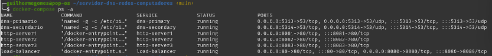
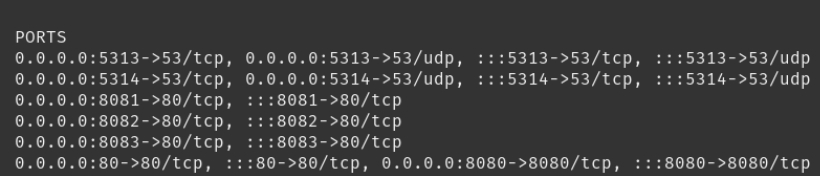

<h1 style="text-align: center;">
  servidor-dns-redes-computadores
</h1>

O objetivo deste trabalho é desenvolver um sistema completo utilizando Docker que inclua um serviço de DNS (primário e secundário) e servidores HTTP com balanceamento de carga.


## Descrição do Projeto

O projeto inclue uma infraestrutura utilizando Docker atendendo os seguintes requisitos de estruturação:

Serviço DNS

    Servidor DNS Primário
    Servidor DNS Secundário

Serviço HTTP

    Servidores HTTP
    Balanceamento de Carga

## Estrutura do Projeto

O projeto está organizado da seguinte forma:

Diretório `dns`

    Dockerfile: Define a imagem Docker para o servidor DNS.
    named.conf: Configuração principal do BIND9.
    db.: Arquivo de zona para o domínio ....
    db.: Arquivo de zona para o domínio backup.
    db.: Arquivo de zona reversa.

Diretório `http`

    Dockerfile: Define a imagem Docker para os servidores HTTP.
    index.html: Página inicial para os servidores HTTP.
    nginx.conf: Configuração do Nginx.

Diretório `load_balancer`

    Dockerfile: Define a imagem Docker para o balanceador de carga.
    haproxy.cfg: Configuração do HAProxy para balanceamento de carga.

Arquivo `docker-compose.yml`

    Define os serviços Docker e como eles interagem entre si.

## Pré-requisitos

    Docker instalado na máquina.
    Docker Compose instalado.

## Como executar o projeto

1. **Clone o repositório do projeto:**

    ```bash
    $ git clone https://github.com/ggomes12/servidor-dns-redes-computadores.git
    ```

2. **Navegue para o diretório do projeto:**

    ```bash
    $ cd servidor-dns-redes-computadores
    ```

3. **Suba os containers:**

    ```bash
    $ docker-compose up 
    ```

4. **Verifique os logs:**

    - No Windows:
      ```bash
      $ docker-compose logs
      ```

    - No MacOS/Linux:
      ```bash
      $ docker-compose logs
      ```

5. **Acesse o sistema:**

    ```bash
    $ curl http://localhost
    ```

6. **Testar o DNS:**

    ```bash
    $ dig @localhost exemplo.com
    ```

7. **Verificar balanceamento de carga:**

    ```bash
    $ curl http://localhost/balanceamento
    ```

## Exemplos de teste na criação e orquestração dos containers docker


1. **Buildando so containers**
   
    Explicação do que será testado: 

    Antes de iniciar os containers, é necessário construir as imagens Docker para cada um dos serviços definidos no arquivo docker-compose.yml. Este passo garante que todas as dependências e configurações estejam prontas para a execução dos containers.

    Comando para buldar os container:

    ```bash
    $ docker-compose build --no-cache
    ```


    

    Explicação do que foi testado:

    O comando docker-compose build --no-cache lê o docker-compose.yml e, em seguida, constrói as imagens Docker conforme especificado nos respectivos Dockerfiles. Este comando prepara todas as imagens necessárias para serem executadas como containers, garantindo que todas as dependências sejam baixadas e configuradas corretamente sem utilizar cache.

2. **Upando os containers**

    Explicação do que será testado:

    Após construir as imagens, o próximo passo é iniciar os containers. Este comando cria e inicia os containers conforme especificado no arquivo docker-compose.yml.

    Comando para upar os container:

    ```bash
    $  docker-compose up -d
    ```
    


    Explicação do que foi testado:

    O comando docker-compose up -d inicia os containers em modo desacoplado (background). Isso permite que os serviços definidos no docker-compose.yml sejam executados como containers independentes. A saída do comando confirma a criação e o início dos containers, bem como a criação das redes necessárias.

3. **Verificando os containers**

    Explicação do que será testado:

    Após iniciar os containers, é importante verificar se todos estão em execução conforme esperado. Este comando lista todos os containers em execução e seus respectivos estados.

    Comando para verificar os container:

    ```bash
    $ docker-compose ps

    ```
    
    
    imagens para melhor visualização:

    
    

    Explicação do que foi testado:

    O comando docker-compose ps lista todos os containers definidos no docker-compose.yml que estão em execução, juntamente com seus status, portas expostas e comandos de inicialização. Isso confirma que todos os serviços foram iniciados corretamente e estão prontos para uso.

Os containers acima já estão funcionando. A partir do próximo tópico, será mostrado os testes de cada um deles.

## Exemplos de teste para cada container


1. **Abrindo um branch dentro do container, com o comando**:


    ```bash
    $ docker exec -it dns-primario /bin/bash

    ```

    

    O comando acima serve para abrir um terminal bash (shell) dentro do container chamado dns-primario.

2. **Resolução de nomes no primário**

    

    Uma vez que o terminal bash no container esteja aberto, o comando dig pode ser utilizado para testar a resolução de nomes internamente.


3. **Resolução de nomes no secundário**


## Funcionalidades

## Conclusão

Este projeto acadêmico demonstra a criação de uma infraestrutura de rede utilizando Docker, incluindo serviços de DNS primário e secundário, bem como servidores HTTP com balanceamento de carga. Esta implementação é útil para entender na prática os conceitos de redes e a utilização de containers para gerenciamento de serviços.

## Autores

    Crisly Maria
    Erik Vinicius
    Guilherme Gomes

## Licença

Este projeto é licenciado sob a Licença MIT - veja o arquivo LICENSE para mais detalhes.
