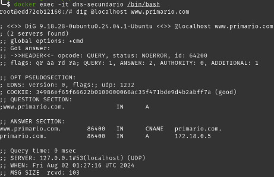

<h1 style="text-align: center;">
  servidor-dns-redes-computadores
</h1>

O objetivo deste trabalho é desenvolver um sistema completo utilizando Docker que inclua um serviço de DNS (primário e secundário) e servidores HTTP com balanceamento de carga.


## Descrição do Projeto

O projeto inclue uma infraestrutura utilizando Docker atendendo os seguintes requisitos de estruturação:

**Serviço DNS**

    Servidor DNS Primário
    Servidor DNS Secundário

**Serviço HTTP**

    Servidores HTTP
    Balanceamento de Carga

## Estrutura do Projeto

O projeto está organizado da seguinte forma:

Diretório `dns`

    Dockerfile: Define a imagem Docker para o servidor DNS.
    named.conf: Configuração principal do BIND9 (Includes e controls)
    db.primario.com: Arquivo de zona para o domínio principal (dns-primário)
    named.conf.local.primario: Configuração de zona master (primária)
    named.conf.local.secundária: Configuração de zona slave (secundária)
    named.conf.options: Configuração de opções.
    rndc.key: Chave para acesso remoto rndc.
    
Diretórios `http1`, `http2` e `http3` 

    Dockerfile.http: Define a imagem Docker para os servidores HTTP.
    index.html: Página estática html para os servidores HTTP.
    nginx.conf: Configuração do Nginx.
    resolv.conf: Configuração de ip (nameserver).

Diretório `load_balancer`

    Dockerfile: Define a imagem Docker para o balanceador de carga.
    haproxy.cfg: Configuração do HAProxy para balanceamento de carga.

Arquivo `docker-compose.yml`

    Define a orquestração dos serviços nos containers Docker e como eles interagem entre si.

## Pré-requisitos

    Docker instalado na máquina.
    Docker Compose instalado.

## Como executar o projeto

1. **Clone o repositório do projeto:**

    ```bash
    $ git clone https://github.com/ggomes12/servidor-dns-redes-computadores.git
    ```

2. **Navegue para o diretório do projeto:**

    ```bash
    $ cd servidor-dns-redes-computadores
    ```

3. **Build os containers:**

    ```bash
    $ docker-compose build --no-cache
    ```
    
4. **Suba os containers:**

    ```bash
    $ docker-compose up -d
    ```

5. **Verifique os logs:**

    - No Windows:
      ```bash
      $ docker-compose logs <nome-container>
      ```

    - No MacOS/Linux:
      ```bash
      $ docker-compose logs <nome-container>
      ```

6. **Acesse o sistema:**

    ```bash
    $ curl http//:www.primario.com
    ```

7. **Testar o DNS:**

    ```bash
    $ dig @<nome-container> www.primario.com
    ```

8. **Verificar balanceamento de carga:**

    ```bash
    $ curl http://www.primario.com
    ```

## Exemplos de teste na criação e orquestração dos containers docker


1. **Buildando so containers**
   
    **Explicação do que será testado:**

    Antes de iniciar os containers, é necessário construir as imagens Docker para cada um dos serviços definidos no arquivo docker-compose.yml. Este passo garante que todas as dependências e configurações estejam prontas para a execução dos containers.

    **Comando para buldar os container:**

    ```bash
    $ docker-compose build --no-cache
    ```


    

    **Explicação do que foi testado:**

    O comando docker-compose build --no-cache lê o docker-compose.yml e, em seguida, constrói as imagens Docker conforme especificado nos respectivos Dockerfiles. Este comando prepara todas as imagens necessárias para serem executadas como containers, garantindo que todas as dependências sejam baixadas e configuradas corretamente sem utilizar cache já salvo anteriormente, caso você já tenha executado alguma vez.

2. **Upando os containers**

    **Explicação do que será testado:**

    Após construir as imagens, o próximo passo é iniciar os containers. Este comando cria e inicia os containers conforme especificado no arquivo docker-compose.yml.

    **Comando para upar os container:**

    ```bash
    $  docker-compose up -d
    ```
    


    **Explicação do que foi testado:**

    O comando docker-compose up -d inicia os containers em modo desacoplado (background). Isso permite que os serviços definidos no docker-compose.yml sejam executados como containers independentes. A saída do comando confirma a criação e o início dos containers, bem como a criação das redes necessárias.

3. **Verificando os containers**

    **Explicação do que será testado:**

    Após iniciar os containers, é importante verificar se todos estão em execução conforme esperado. Este comando lista todos os containers em execução e seus respectivos estados.

    **Comando para verificar os container:**

    ```bash
    $ docker-compose ps -a

    ```
    

    **Explicação do que foi testado:**

    O comando docker-compose ps lista todos os containers definidos no docker-compose.yml que estão em execução, juntamente com seus status, portas expostas e comandos de inicialização. Isso confirma que todos os serviços foram iniciados corretamente e estão prontos para uso. Utilizando a flag -a, será mostrado também os containers que estão com status em exit(1), isso é importante para verificarmos os que executaram e os que não executaram.

Os containers acima já estão funcionando. A partir do próximo tópico, será mostrado os testes de cada um deles.

## Exemplos de teste para cada container


1. **Abrindo um branch dentro do container, com o comando**:


    ```bash
    $ docker exec -it dns-primario /bin/bash
    ```

    

    O comando acima serve para abrir um terminal bash (shell) dentro do container chamado dns-primario.

2. **Resolução de nomes no primário**

    

    Uma vez que o terminal bash no container esteja aberto, o comando dig pode ser utilizado para testar a resolução de nomes internamente.
   


3. **Resolução de nomes no secundário**

    **Explicação do que será testado:**

    Para garantir que o servidor DNS secundário está funcionando corretamente e pode resolver nomes de domínio do servidor DNS primário, realizamos uma consulta DNS diretamente no container do servidor DNS secundário.

    Comando para acessar o container do servidor DNS secundário e realizar a consulta:

    ```bash
    $ docker exec -it dns-secundario /bin/bash
    ```

    

    
    **Explicação do que foi testado:**

    O comando docker exec -it dns-secundario /bin/bash permite acessar o terminal interativo do container do servidor DNS secundário. Dentro desse container, o comando dig @localhost www.primario.com é utilizado para testar a resolução de nomes, consultando o servidor DNS primário para verificar se o domínio primario.com é resolvido corretamente. Esse teste confirma que o servidor DNS secundário pode se comunicar com o primário e resolver nomes de domínio conforme esperado.


4. **Verificando a conectividade entre os servidores HTTP**
    **Explicação do que será testado:**

    Para garantir que os servidores HTTP podem se comunicar entre si, acessamos o container do http-server1 e utilizamos o comando ping para verificar a conectividade com os outros dois servidores HTTP (http-server2 e http-server3).

    Comando para acessar o container do http-server1 e realizar o ping:
    ```bash
    $ docker exec -it http-server1 /bin/bash

    ```

    Dentro do terminal do container:
    ```bash
    $ ping http-server2
    $ ping http-server3

    ```
    

    **Explicação do que foi testado:**
    
    Após acessar o container do http-server1, utilizamos o comando ping para verificar a conectividade entre os servidores HTTP (http-server2 e http-server3). Isso confirma que os servidores HTTP podem se comunicar entre si, garantindo a funcionalidade correta da rede configurada pelo Docker Compose.


5. **Testando a falha do servidor DNS primário**

    **Explicação do que será testado:**

    Para garantir que o servidor DNS secundário (dns-secundario) pode atuar como substituto do servidor DNS primário (dns-primario) em caso de falha, paramos o container do servidor DNS primário e verificamos se o servidor DNS secundário consegue resolver consultas para a zona primario.com. Esse teste confirma que o servidor DNS secundário está corretamente configurado para assumir a função do primário em caso de falha.

    Parando o container do servidor DNS primário:
    ```bash
    $ docker stop dns-primario
    ```
    Acessando o container do dns-secundario e solicitando a resolução de nome:
    ```bash
    $ docker exec -it dns-secundario /bin/bash
    ```
    Comando para verificar o estado dos containers:
    ```bash
    $ docker-compose ps -a
    ```
    

    Comando para acessar o container do dns-secundario e realizar a consulta:
    ```bash
    $ docker exec -it dns-secundario /bin/bash
    ```
    Dentro do terminal do container dns-secundario:
    ```bash
    $ dig @localhost www.primario.com
    ```
    

    **Explicação do que foi testado:**

    Após parar o container do dns-primario, utilizamos o comando docker-compose ps -a para verificar que o container do dns-primario está parado e que os outros containers estão em execução. Em seguida, acessamos o container do dns-secundario e utilizamos o comando dig primario.com para solicitar a resolução do nome primario.com. O comando retornou a resposta correta, demonstrando que o servidor DNS secundário está atuando corretamente no lugar do servidor primário em caso de falha. Isso confirma que o servidor DNS secundário está configurado para continuar fornecendo resolução de nomes mesmo na ausência do servidor primário.

6. **Inspecionando as redes ativas no Docker**

    **Explicação do que será testado:**

    Para testar o balanceamento de carga, é essencial verificar as redes ativas no Docker para garantir que todas as redes necessárias estão corretamente configuradas. Isso inclui inspecionar a rede específica onde os containers HTTP estão conectados, o que é crucial para testar a distribuição de carga entre os servidores HTTP.

    **Passo 1:** Inspecionando as redes ativas no Docker:
    ```bash
    $ docker network ls
    ```
    

    **Passo 2:** Inspecionando a rede httpnet:

    Para testar a distribuição da carga, é importante inspecionar a rede httpnet, que contém todos os IPs dos containers HTTP. Isso permite verificar quais IPs estão associados aos servidores HTTP e garantir que a distribuição da carga está funcionando corretamente.
    ```bash
    $ docker network inspect httpnet
    ```
    

    

    **Explicação do que foi testado:**

    O comando docker network ls lista todas as redes ativas no Docker, permitindo confirmar que as redes necessárias estão disponíveis e funcionando. Em seguida, o comando docker network inspect httpnet fornece detalhes específicos sobre a rede httpnet, incluindo todos os IPs dos containers HTTP conectados a essa rede. A visualização desta rede é crucial para testar o balanceamento de carga, pois mostra quais servidores HTTP estão disponíveis e conectados. As imagens mostram todos os IPs dos containers HTTP na rede httpnet, permitindo verificar se a configuração da distribuição da carga está correta. A imagem acima e a imagem abaixo são uma só, cortada para melhor visualização dos detalhes.


7. **Testando a Redundância dos Servidores Web**

    **Explicação do que será testado:**

    Após inspecionar as redes ativas no Docker e garantir que a configuração está correta, é fundamental testar a redundância dos servidores web. O objetivo é verificar se o balanceador de carga está distribuindo corretamente as requisições entre os servidores web, assegurando que todos os servidores estejam operacionais e que o tráfego esteja sendo gerenciado de forma eficaz.

    **Passo 1:** Realizando múltiplas requisições para o endereço http://www.primario.com:

    Para testar a redundância e a distribuição de carga, serão feitas três requisições em sequência ao endereço http://www.primario.com. Isso permite observar como o balanceador de carga lida com as requisições e distribui o tráfego entre os servidores web disponíveis.
    ```bash
    $ curl http://www.primario.com
    $ curl http://www.primario.com
    $ curl http://www.primario.com
    ```

    

8. **Testando a Falha de um Servidor Web**

    **Explicação do que será testado:**

    Para assegurar a resiliência e a capacidade de recuperação do balanceador de carga, é crucial testar a falha de um servidor web. O objetivo é verificar se, ao parar um dos servidores web, o balanceador de carga continua a distribuir as requisições apenas entre os servidores restantes, garantindo que o tráfego ainda seja gerenciado de forma eficaz e que o serviço permaneça disponível.

    **Passo 1:** Parando o servidor http-server1:

    Para simular a falha de um servidor web, vamos parar o servidor http-server1. Isso permitirá observar se o balanceador de carga redireciona corretamente o tráfego para os outros servidores web ativos.
    
    ```bash
    $ docker stop http-server1
    ```

    **Passo 2:** Realizando múltiplas requisições para o endereço http://www.primario.com:

    Após parar o servidor http-server1, serão feitas três requisições em sequência ao endereço http://www.primario.com. Isso permitirá verificar se o balanceador de carga distribui as requisições apenas entre os servidores restantes (http-server2 e http-server3).

    ```bash
    $ curl http://www.primario.com
    $ curl http://www.primario.com
    $ curl http://www.primario.com
    ```
    

    **Explicação do que foi testado:**

    Parar o servidor http-server1 e realizar as requisições subsequentes permitirá observar se o balanceador de carga está distribuindo as requisições apenas entre os servidores ativos. A verificação deve confirmar que, mesmo com um servidor web inativo, o balanceador de carga continua a funcionar corretamente, gerenciando o tráfego e mantendo a disponibilidade do serviço.

    Na imagem abaixo, observamos o resultado das requisições após a parada do servidor http-server1. Podemos verificar que o balanceador de carga está distribuindo as requisições apenas entre os dois servidores restantes, demonstrando a capacidade de recuperação e a resiliência do sistema.

    

    O teste também pode ser feito no navegador, onde mediante vôce vai atualizando a página, o load-balancer vai também distribuindo entre os 3 servidores (caso estejam todos ativos), ou seja, as requisições só serão distribuídas entre os servidores web ativos.

    **Servidor 1:**

    

    **Servidor 2:**

    

    **Servidor 3:**

    


## Conclusão

O projeto "Servidor DNS e Balanceamento de Carga com Docker" foi desenvolvido com o objetivo de criar uma infraestrutura eficiente utilizando Docker para serviços de DNS e HTTP. O sistema implementado inclui servidores DNS primário e secundário, servidores HTTP e um balanceador de carga, com o balanceamento de carga configurado para distribuir requisições de forma eficiente entre os servidores HTTP.

## Principais Realizações

1. **Configuração de Servidores DNS:**

    Implementação de servidores DNS primário e secundário usando BIND9, permitindo a resolução de nomes e replicação de dados entre servidores.

2. **Serviços HTTP:**

    Configuração de múltiplos servidores HTTP com conteúdo estático, garantindo que os serviços estejam disponíveis e funcionem conforme esperado.
   
    Balanceamento de Carga:
    Implementação de um balanceador de carga usando HAProxy para distribuir requisições entre os servidores HTTP de forma eficiente, utilizando o método Round Robin.
   
    Orquestração com Docker:
    Utilização do Docker e Docker Compose para criar e gerenciar containers, simplificando o processo de deploy e garantindo a escalabilidade da infraestrutura.

4. **Resultados dos Testes:**

    Serviço DNS:
   A comunicação e resolução de nomes entre os servidores DNS foram validadas com sucesso. O servidor DNS secundário demonstrou capacidade de assumir a função do primário em caso de falha.

    Serviços HTTP:
   Todos os servidores HTTP responderam corretamente às requisições, e a conectividade entre eles foi confirmada.

    Balanceamento de Carga: O balanceador de carga distribuiu as requisições entre os servidores HTTP conforme esperado, e os logs confirmaram que o método Round Robin está funcionando corretamente.

## Considerações Finais
Este projeto demonstra a eficácia do Docker para gerenciar e orquestrar serviços de rede, proporcionando uma solução escalável e eficiente para serviços DNS e HTTP com balanceamento de carga. A configuração e os testes realizados confirmam a funcionalidade e a resiliência da infraestrutura implementada, garantindo um ambiente robusto para a operação de serviços de rede.

## Autores

    Crisly Santos
    Erik Lustosa
    Guilherme Gomes

